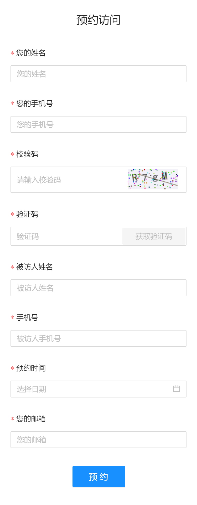
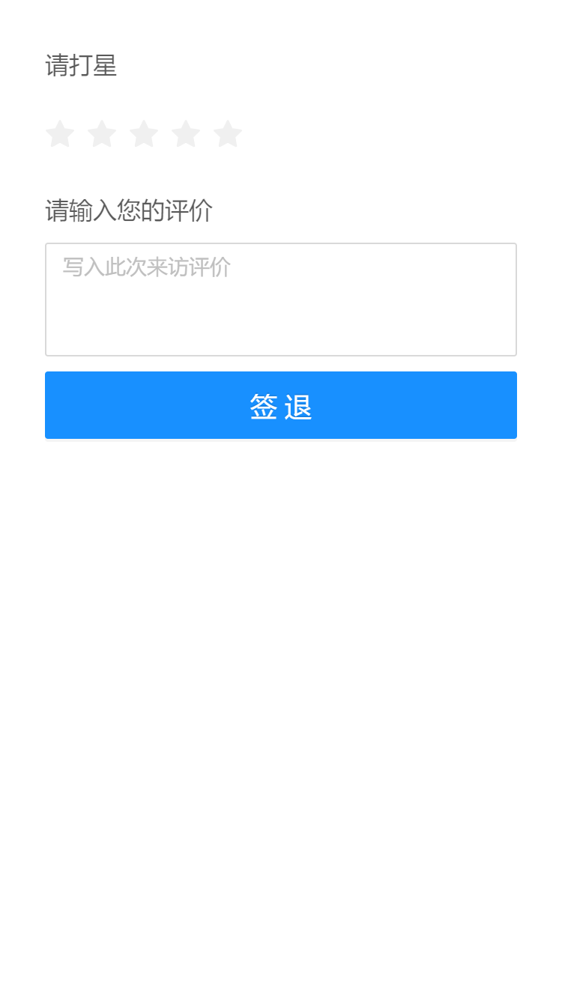

# 访客管理系统
该系统采用react框架实现了访客预约，签到，评价。
用户登录，注册，访客信息管理功能，员工信息管理功能，角色管理，访客数据图表，黑名单等功能。

visitServer文件夹是后台（node+express ），进入文件夹运行npm start即可启动
  打开文件夹里面router文件夹存放的是前端使用的各个入口，app.js中定义了接口名称
  
  
visitor-manage文件夹是前端项目，进入文件夹运行npm start即可启动
  
src—>router—>home        //首页页面

  
src—>router—>view        //访客信息管理相关页面存放

  
src—>router—>visiter     //预约，签到，签退等页面

  
src—>router—>index.js    //设置路由

  
下面是各个页面图片

